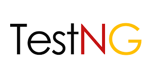

 

### Love to See You Here 

- ##  About Me:

    😄 Pronouns: He/Him

    ⚡ Fun Fact: If you find one, share it with me!

- ## Support

- ❤️ To show more support:
    [BUY ME A COFFEE](https://buymeacoffee.com/dandademitz)
   👏🏿 [sponsor me]

- ⭐️ Simplest way to say Thanks is just to it a Star 🤩  
- ✨ Contributions of any kind are welcome!

  
### If my repository is helpful for you then [Nominate me for GitHub Star](https://stars.github.com/nominate/)
---

 
 
<h1 align="center"> Certifications </h1>

---

<h1 align="left">Languages & Framework </h1>

**Operating System**
|||
--- | --- | --- |

**Java Based Testing & Reporting Tool**

 <a href="https://developer.android.com" target="_blank" rel="noreferrer"> 

  

 
 

 **U.I MockUp Tools**
|
--- |

 **SCM**
 
|<a href="https://git-scm.com/" target="_blank" rel="noreferrer"> |</a>  
--- | --- |

 **Dev-Ops Tools**
 
 </a>
 
 

 </a>

 
  
  
   

**Mobile Operating System**
 
|| </a>
 --- | --- |

 **Real Time Monitoring Tool**
 
 |
--- |

 **Node Environment Tools**
 
 

 
 

 

**Application Lifecycle Management Tools**
 
|
--- |

**BackEnd Database Provider** 
 

**API Testing Tools**
 

  
  </a>
 
<a href="https://rest-assured.io/" target="_blank" title ="REST assured" rel="noreferrer">  
   

**Javascript & Typescript Based Framework**
 

**FrontEnd Coding**

||
--- | --- |

 **Robot Framework**
 
|
--- |
 
 **Non-Functional Testing Tools**
|| <a href="https://www.blazemeter.com/" target="_blank" title ="Blazemeter" rel="noreferrer">| </a>
--- | --- |  --- |
  

 **Java Apache Libraries**
|
--- |
 
**Communication Tool**

| |  
--- | --- |

**Browser Support**
 |  |  |  | 
--- | --- | --- | --- | --- |
Latest ✔ | Latest ✔ | 10+ ✔ | Latest ✔ | 6.1+ ❌ |

_____________________________________________________________________________________________________________________________________
### Connect With Me
 

 
  
  

