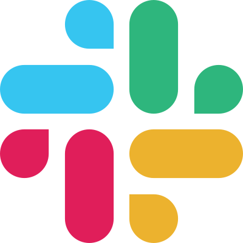
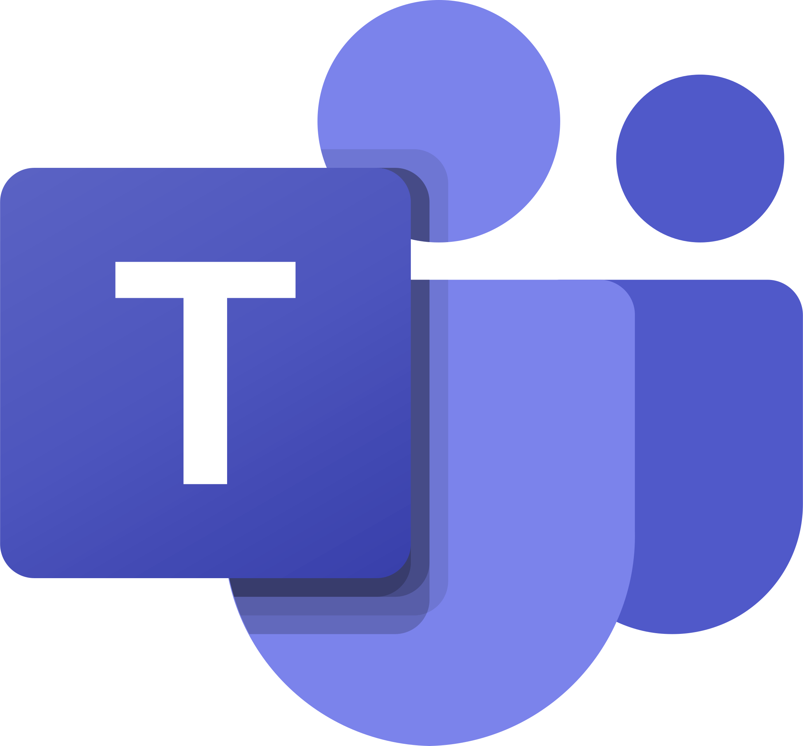

<!-- SEO: Quality Assurance Engineer, Test Automation Architect, CI/CD, cloud testing, and quality engineering portfolio. -->

  

  

<h1 align="center">Mitesh Dandade</h1>

<strong>Quality Assurance Engineer &amp; Test Automation Architect</strong>

  <a href="https://www.linkedin.com/in/mitesh-dandade-1a62085b">Connect on LinkedIn</a>
  &nbsp;•&nbsp;
  <a href="mailto:mailme.dandademitesh@gmail.com">Email me</a>
  &nbsp;•&nbsp;
  <a href="https://github.com/Mitesh411">Explore GitHub</a>

  

> **Welcome!** I’m glad you’re here. Explore my quality-engineering toolkit, connect with me, or support the work below.

## About me

Hi — I'm Mitesh, a Quality Assurance Engineer and Test Automation Architect focused on building robust, scalable testing frameworks and integrating test automation into CI/CD pipelines.

- 🔭 **Currently focused on:** Advanced automation, test infrastructure, and DevOps integration.
- 🎓 **Certifications:** ISTQB CTFL, AWS Certified Cloud Practitioner, and Azure Certified Cloud Practitioner.
- ⚡ **Fun fact:** If you find a bug in my code... no you didn't, that's a feature! (But seriously, share it with me.)

  <a href="#languages--frameworks">View my toolkit</a>
  &nbsp;|&nbsp;
  <a href="#connect-with-me">Start a conversation</a>

---

## Support / Sponsor

❤️ If my work helps you, consider supporting me:

  
  <a href="https://buymeacoffee.com/dandademitz"><strong>BUY ME A COFFEE</strong></a> 👏🏿

- ⭐️ The simplest way to say thanks is to give a repository a star. 🤩
- ✨ Contributions of any kind are welcome!

**If a repository has been helpful, [nominate me for GitHub Star](https://stars.github.com/nominate/).**

---

## Certifications

  
  
  
  

## 🧠 Languages &amp; Frameworks

### 💻 Operating Systems

| Linux | Windows | macOS |
| :---: | :-----: | :---: |
|  |  |  |

### 🌐 Programming Languages

| Java | JavaScript | TypeScript |
| :--: | :--------: | :--------: |
|  |  |  |

###  Java-Based Automation Testing Tools

| Selenium | TestNG | JUnit | Cucumber | Allure | Spring | Serenity BDD |
| :------: | :----: | :---: | :------: | :----: | :----: | :----------: |
|  |  |  |  |  |  |  |

### 🟨 JavaScript / TypeScript Automation

| Cypress | Playwright | Puppeteer | Katalon |
| :-----: | :--------: | :-------: | :-----: |
|  |  |  |  |

### 📱 Mobile Test Automation

| Appium | Espresso | XCUITest | Detox |
| :----: | :------: | :------: | :---: |
|  |  |  |  |

### 🔌 API &amp; Contract Testing

| Postman | REST Assured | GraphQL | gRPC | Pact | Karate DSL | WireMock | MockServer |
| :-----: | :----------: | :-----: | :--: | :--: | :--------: | :------: | :--------: |
|  |  |  |  |  |  |  |  |

### ⚡ Performance &amp; Load Testing

| JMeter | k6 | Gatling | Locust | BlazeMeter |
| :----: | :-: | :-----: | :----: | :--------: |
|  |  |  |  |  |

### 🔒 Security Testing

| OWASP ZAP | Burp Suite | Dependency-Check | Snyk | Trivy |
| :-------: | :--------: | :--------------: | :--: | :---: |
|  |  |  |  |  |

### 🧱 Test Infrastructure &amp; Environment

| TestContainers | Docker | Docker Compose | Kubernetes | Vagrant | BrowserStack | Sauce Labs |
| :------------: | :----: | :------------: | :--------: | :-----: | :----------: | :--------: |
|  |  |  |  |  |  |  |

### 🔁 CI/CD &amp; Test Orchestration

| Jenkins | GitHub Actions | GitLab CI | Azure DevOps | CircleCI | AWS |
| :-----: | :------------: | :-------: | :----------: | :------: | :-: |
|  |  |  |  |  |  |

### 🧩 BDD &amp; Test Design

| Cucumber | Reqnroll | Behave | Gauge |
| :------: | :------: | :----: | :---: |
|  |  |  |  |

### 🗄️ Backend Database Providers

  
  
  
  
  
  
  

### 📊 Reporting &amp; Observability

| Allure | Extent Reports | ReportPortal | Grafana | ELK Stack |
| :----: | :------------: | :----------: | :-----: | :-------: |
|  |  |  |  |  |

### 🧠 Quality Engineering Utilities

| SonarQube | JaCoCo | Codacy | Faker JS | Test Data Builders |
| :-------: | :----: | :----: | :------: | :----------------: |
|  |  |  |  |  |

### 💬 Communication Tools

| Slack | Teams | Google Meet |
| :---: | :---: | :---------: |
|  |  |  |

### 🎨 UI Mockup Tools

| Figma |
| :---: |
|  |

### 🔧 Source Control Management

| Git | GitHub |
| :-: | :----: |
|  |  |

### 🌐 Browser Support

| Chrome | Firefox | Edge | Brave | Safari | Chromium |
| :----: | :-----: | :--: | :---: | :----: | :------: |
|  |  |  |  |  |  |
| Latest ✔ | Latest ✔ | Latest ✔ | Latest ✔ | Latest ✔ | Latest ✔ |

---

## Connect with me

  
  &nbsp;
  
  &nbsp;
  

**Ready to collaborate? [Send me an email](mailto:mailme.dandademitesh@gmail.com) or [connect on LinkedIn](https://www.linkedin.com/in/mitesh-dandade-1a62085b).**

---

## Ownership of Logo and Brand Assets

All logos, brand icons, trademarks, service marks, trade names, and other related visual elements (collectively, the “Brand Assets”) are and shall remain the exclusive property of their respective company. Such Brand Assets are protected by applicable trademark, copyright, and other intellectual property laws.

Nothing in these Terms shall be construed as granting any ownership rights, title, or interest in the Brand Assets to any third party. Any and all goodwill generated through the use of the Brand Assets shall inure solely to the benefit of their respective company.
