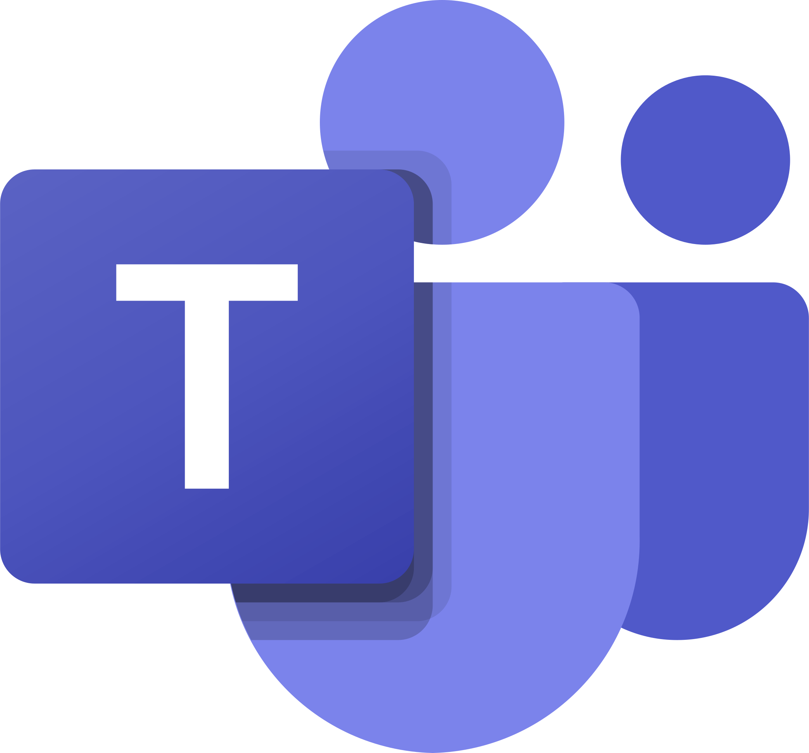

 

### Love to See You Here 

- ##  💫 About Me:

I am a passionate **Quality Assurance Engineer** and **Test Automation Architect** dedicated to building robust, scalable testing frameworks and ensuring high-quality software delivery.

* 🛠️ Currently focusing on Advanced Automation & DevOps integration.
* 🎓 AWS & Azure Certified Cloud Practitioner.
* ⚡ **Fun Fact:** If you find a bug in my code... no you didn't, that's a feature! (But seriously, share it with me).

❌❌❌❌❌❌❌❌❌❌❌❌❌❌❌❌❌❌❌❌❌❌❌❌

- ## Support

- ❤️ To show more support:
    [BUY ME A COFFEE](https://buymeacoffee.com/dandademitz)
   👏🏿 [sponsor me]

- ⭐️ Simplest way to say Thanks is just to it a Star 🤩  
- ✨ Contributions of any kind are welcome!

  
### If my repository is helpful for you then [Nominate me for GitHub Star](https://stars.github.com/nominate/)
---

 
 
<h1 align="center"> Certifications </h1>

# 🧠 Languages & Frameworks

## 💻 Operating Systems

| Linux | Windows | macOS |
|------|---------|-------|
|  |  |  |

---

## 🌐 Programming Languages

| Java | JavaScript | TypeScript |
|------|------------|------------|
|  |  |  |

---

##   Java-Based Automation Testing Tool

| Selenium                                                                                | TestNG                               | JUnit                               | Cucumber                               | Allure                                                                            | Spring                                                                               | Serenity BDD                                                                                               |
| --------------------------------------------------------------------------------------- | ------------------------------------ | ----------------------------------- | -------------------------------------- | --------------------------------------------------------------------------------- | ------------------------------------------------------------------------------------ | ---------------------------------------------------------------------------------------------------------- |
|  |  |  |  |  |  |  |

 ---

 ## 🟨 JavaScript / TypeScript Automation

| Cypress                                                                                                                                        | Playwright                                                                                                                | Puppeteer                                                                              | Katalon                                                                                                       |
| ---------------------------------------------------------------------------------------------------------------------------------------------- | ------------------------------------------------------------------------------------------------------------------------- | -------------------------------------------------------------------------------------- | ------------------------------------------------------------------------------------------------------------- |
|  |  |  |  |

## 📱 Mobile Test Automation

| Appium | Espresso | XCUITest | Detox |
|--------|----------|----------|-------|
|  |  |  |  |

---

## 🔌 API & Contract Testing

| Postman | REST Assured | GraphQL | gRPC | Pact | Karate DSL | WireMock | MockServer |
|--------|--------------|---------|------|------|------------|----------|------------|
|  |  |  |  |  |  |  |  |

---

## ⚡ Performance & Load Testing

| JMeter | k6 | Gatling | Locust | BlazeMeter |
|-------|----|---------|--------|------------|
|  |  |  |  |  |

---

## 🔒 Security Testing

| OWASP ZAP | Burp Suite | Dependency-Check | Snyk | Trivy |
|-----------|------------|------------------|------|-------|
|  |  |  |  |  |

---

## 🧱 Test Infrastructure & Environment

| TestContainers | Docker | Docker Compose | Kubernetes | Vagrant | Browserstack | Sauce Labs |
|---------------|--------|----------------|------------|---------|------------|---------|
|  |  |  |  |  |  |  |

---

## 🔁 CI/CD & Test Orchestration

| Jenkins | GitHub Actions | GitLab CI | Azure DevOps | CircleCI |  AWS |
|--------|----------------|-----------|---------------|----------| ----------|
|  |  |  |  |  |    |

---

## 🧩 BDD & Test Design

| Cucumber | Reqnroll | Behave | Gauge |
|---------|----------|--------|-------|
|  |  |  |  |

---
**BackEnd Database Provider** 
 

---

## 📊 Reporting & Observability

| Allure | Extent Reports | ReportPortal | Grafana | ELK Stack |
|--------|----------------|--------------|---------|-----------|
|  |  |  |  |  |

---

## 🧠 Quality Engineering Utilities

| SonarQube | JaCoCo | Codacy | Faker JS | Test Data Builders |
|----------|--------|----------------|-------|--------------------|
|  |  |  |  |  |

---
**Communication Tool**

| Slack | Teams | Google Meet |
|--------|----------------|--------------|
| |  | 

 **U.I MockUp Tools**
|
--- |

 **SCM**
 
|<a href="https://git-scm.com/" target="_blank" rel="noreferrer"> |</a>  
--- | --- |

--------
**Browser Support**
 |  |  |  | 
--- | --- | --- | --- | --- |
Latest ✔ | Latest ✔ | Latest ✔ | Latest ✔ | Latest ✔ |

_____________________________________________________________________________________________________________________________________
### Connect With Me
 

 

  _____________________________________________________________________________________________________________________________________
## Ownership of Logo and Brand Assets

All logos, brand icons, trademarks, service marks, trade names, and other related visual elements (collectively, the “Brand Assets”) are and shall remain the exclusive property of their respective company. Such Brand Assets are protected by applicable trademark, copyright, and other intellectual property laws.

Nothing in these Terms shall be construed as granting any ownership rights, title, or interest in the Brand Assets to any third party. Any and all goodwill generated through the use of the Brand Assets shall inure solely to the benefit of their respective company.  

