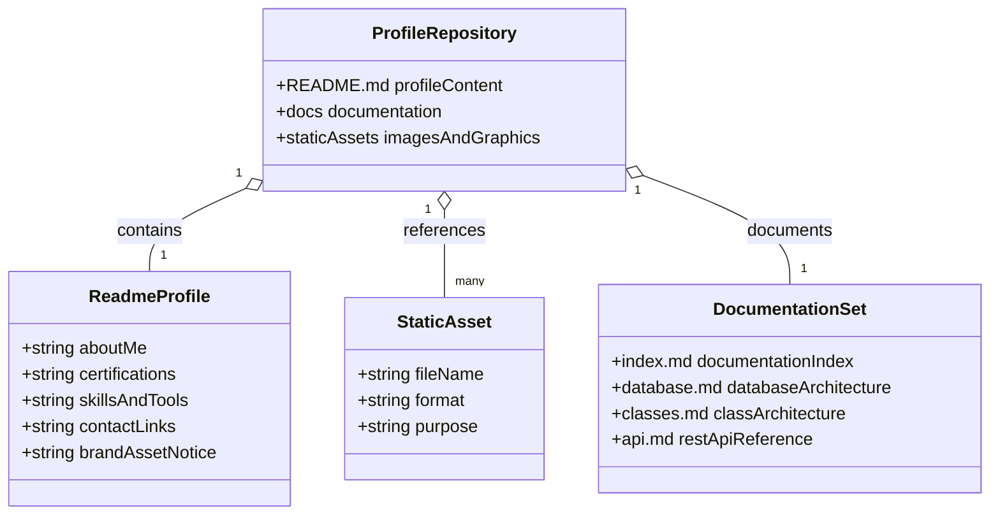

# Class Architecture

## Scope

This document captures class-level architecture discovered in the repository. The current repository is a GitHub profile/portfolio repository made up of Markdown and static assets. No class-based source code was found.

## Current UML Diagram

The following Mermaid class diagram represents the current repository structure rather than application runtime classes.

## Class Inventory

No application classes are currently implemented.

| Class | File | Description | Attributes | Methods | Relationships |
| --- | --- | --- | --- | --- | --- |
| _None found_ | Not applicable | No source code classes are present. | Not applicable | Not applicable | Not applicable |

## Repository Structure Concepts

Although no runtime classes exist, the repository can be understood through the following documentation concepts:

| Concept | Description |
| --- | --- |
| `ProfileRepository` | The repository as a whole, containing the profile README, documentation, and supporting assets. |
| `ReadmeProfile` | The main profile page describing professional background, certifications, tooling, and contact channels. |
| `StaticAsset` | Image and vector files used by the profile README. |
| `DocumentationSet` | The documentation files under `docs/` that describe the current architecture inventory. |

## Recommendations for Future Class Documentation

If application code is added later, update this document with:

1. All domain, service, controller, repository, model, and utility classes.
2. Class attributes, public methods, inheritance, composition, aggregation, and dependencies.
3. Package/module boundaries.
4. Links from each class entry to source files.
5. Notes about design patterns, lifecycle, and responsibility boundaries.
