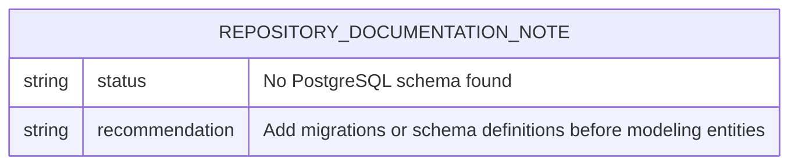

# Database Architecture

## Scope

This document describes the database architecture discovered in the repository. The requested target database is PostgreSQL; however, this repository currently does not contain PostgreSQL schema files, migration files, SQL dumps, ORM definitions, or application code that declares database tables.

## PostgreSQL Schema Status

No PostgreSQL schema is currently implemented in the repository.

Searched repository indicators include:

- SQL schema or migration files such as `*.sql`.
- ORM model files and common migration folders.
- Application configuration files that typically contain PostgreSQL connection details.
- Source files that define database entities.

None were present in the current repository snapshot.

## Entity-Relationship Diagram

Because no database tables or relationships are defined, the current ERD contains a single documentation note node.

## Tables

No PostgreSQL tables are currently defined.

| Table | Description | Fields | Relationships |
| --- | --- | --- | --- |
| _None found_ | The repository currently has no database schema. | Not applicable | Not applicable |

## Field Inventory

No table fields are currently available to document.

| Table | Field | Type | Nullable | Default | Description |
| --- | --- | --- | --- | --- | --- |
| _None found_ | _None found_ | Not applicable | Not applicable | Not applicable | No PostgreSQL fields are defined in this repository. |

## Index Inventory

No PostgreSQL indexes are currently defined.

| Table | Index | Columns | Type | Description |
| --- | --- | --- | --- | --- |
| _None found_ | _None found_ | Not applicable | Not applicable | No indexes are defined because no schema is present. |

## Recommendations for Future Database Documentation

If database-backed application code is added later, update this document with:

1. The canonical schema source, such as migration files or checked-in SQL.
2. A complete ERD showing primary keys, foreign keys, cardinality, and optionality.
3. A table-by-table field catalog with data types, nullability, defaults, constraints, and business meaning.
4. An index catalog including primary keys, unique indexes, foreign-key indexes, partial indexes, and GIN/GiST indexes where applicable.
5. Any PostgreSQL-specific features such as extensions, enums, views, triggers, stored procedures, row-level security policies, or partitioning.
